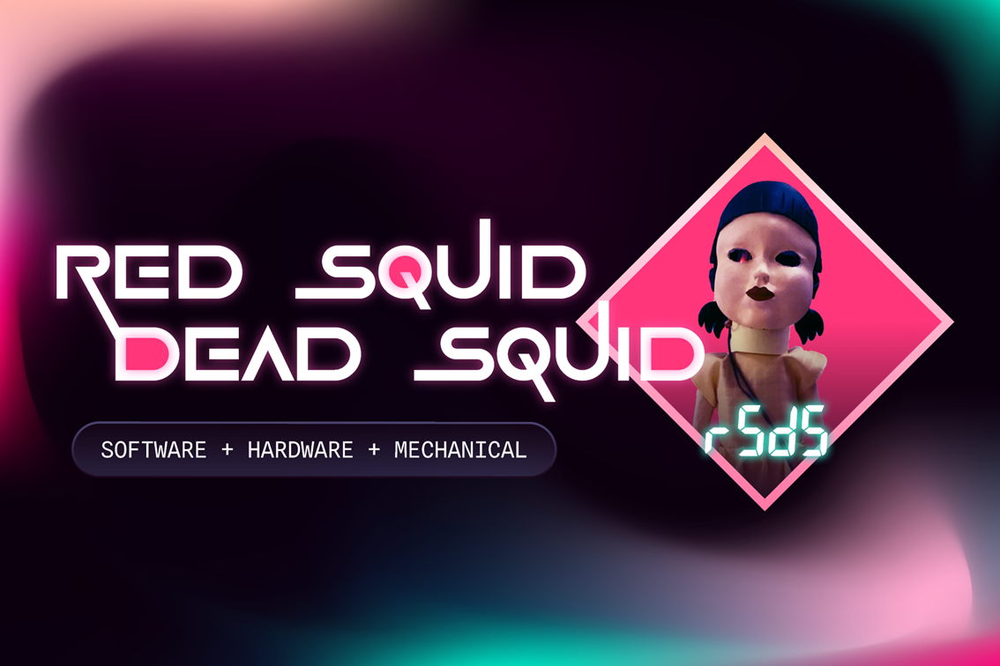
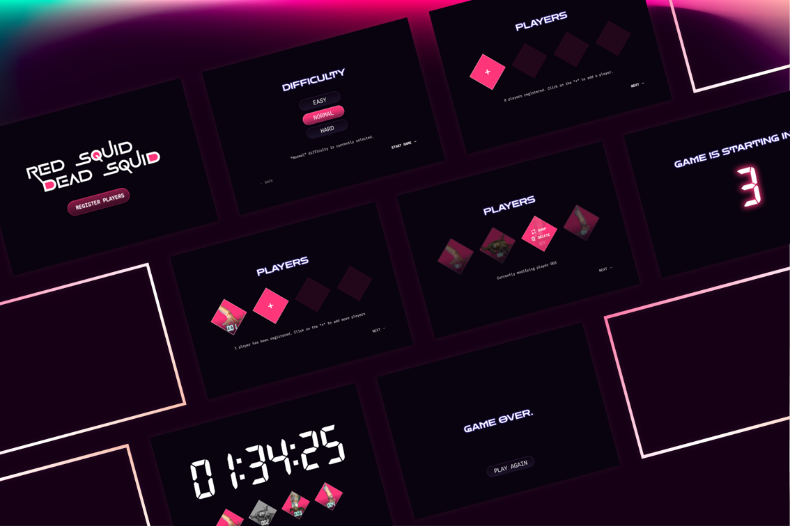
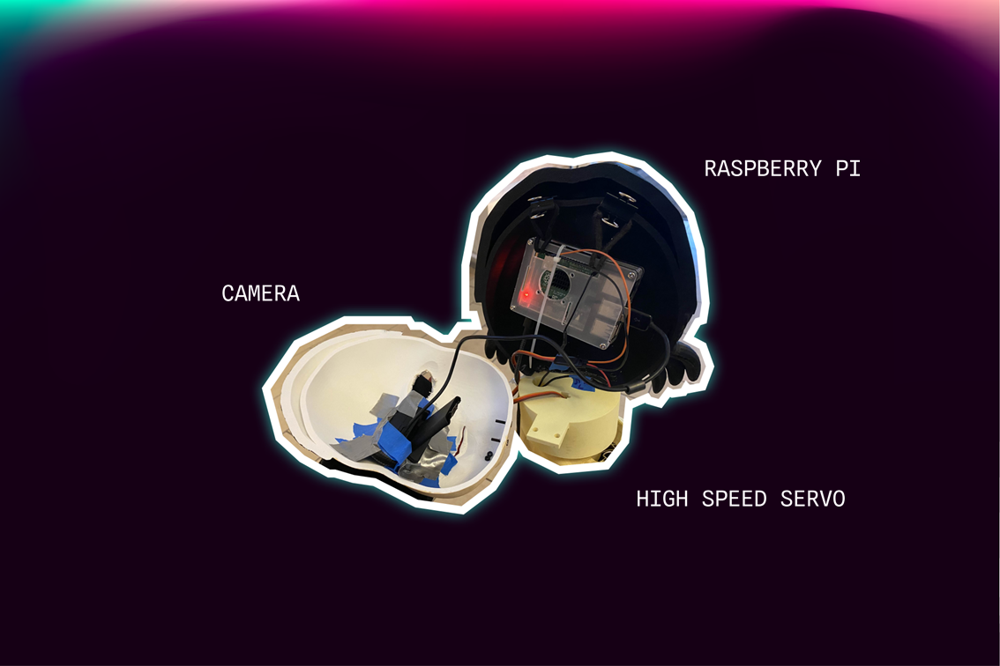
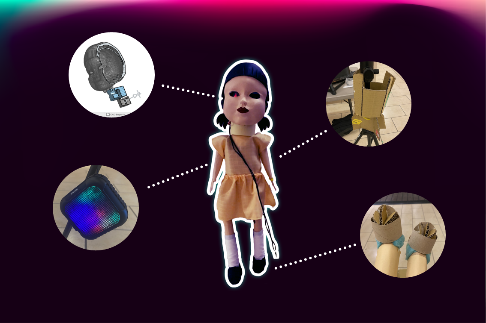

# Red Squid Dead Squid

## Overview
Inspired by the iconic 'Red Light, Green Light' game from Netflix's 'Squid Game', our project reimagines the deadly doll as an interactive gaming experience. We've combined expertise in mobile development, UI/UX design, robotics, computer vision, and sustainable crafting to create a modern twist on this childhood game.

## How It Works
Players engage through our cross-platform mobile application, compatible with both iOS and Android devices. The gameplay flow:
1. Register with a unique player number and headshot
2. Line up 30 meters from the interactive doll
3. Move during "Green Light"
4. Freeze instantly during "Red Light"
5. Survive or face elimination! 💀

## Tech Stack
- Kotlin Multiplatform
- Ktor
- Python
- Raspberry Pi

## Mobile Application

Our mobile interface features:
- Seamless registration process
- Real-time game status updates
- Player progress tracking
- Cross-platform compatibility

## Technical Implementation

### Doll Hardware
Our robotic doll integrates multiple technologies:
- Raspberry Pi
- High-resolution camera for motion detection
- High-speed servo motors for moving head
- Speaker system
- Custom 3D-printed head design
- Sustainably crafted body using recycled and repurposed materials
